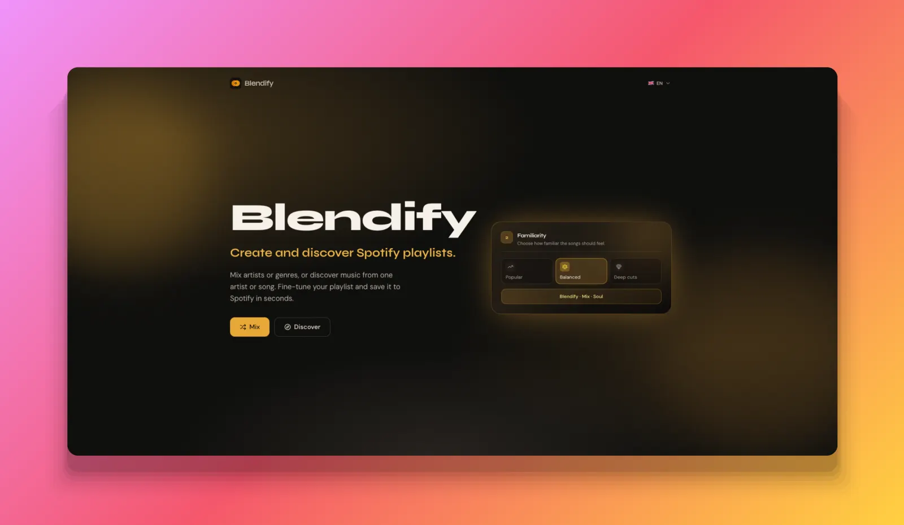
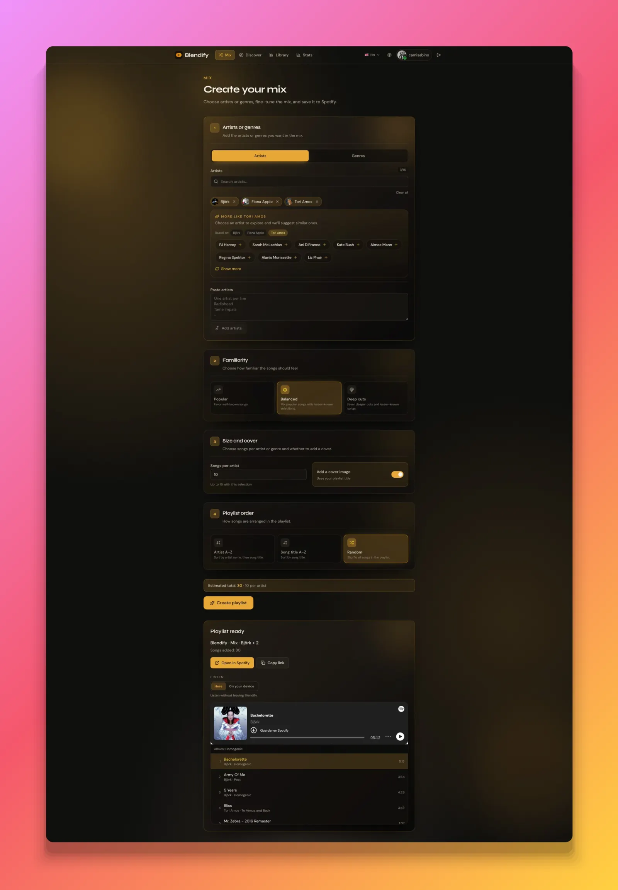
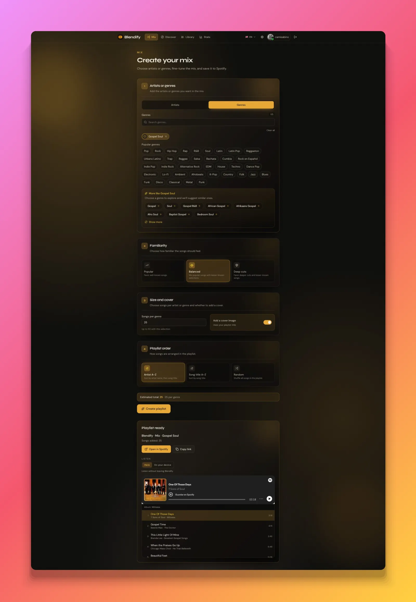
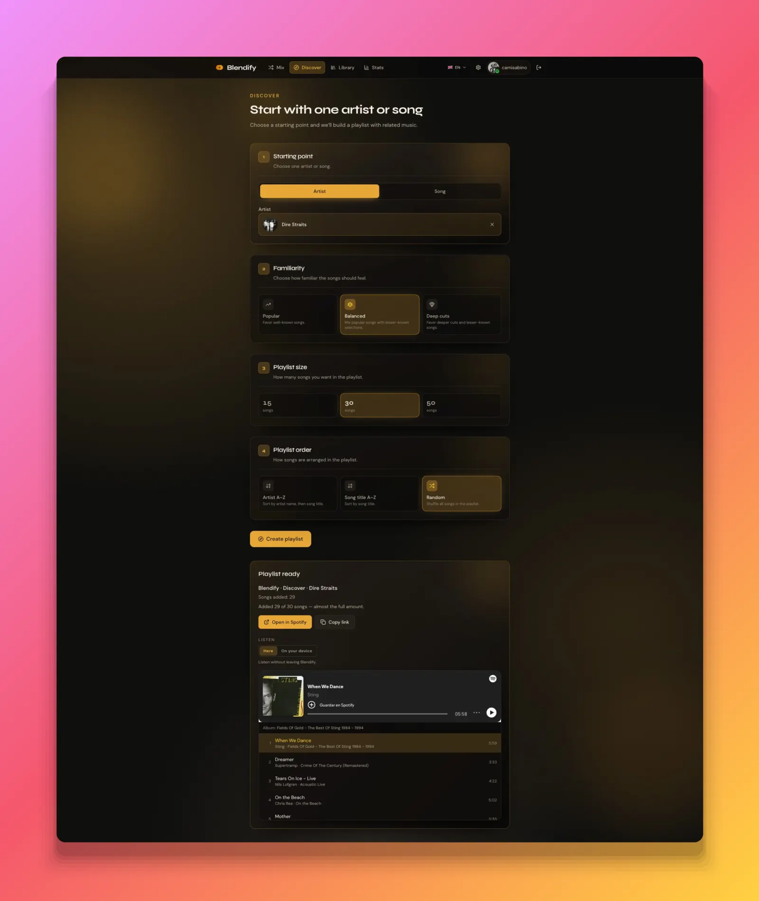
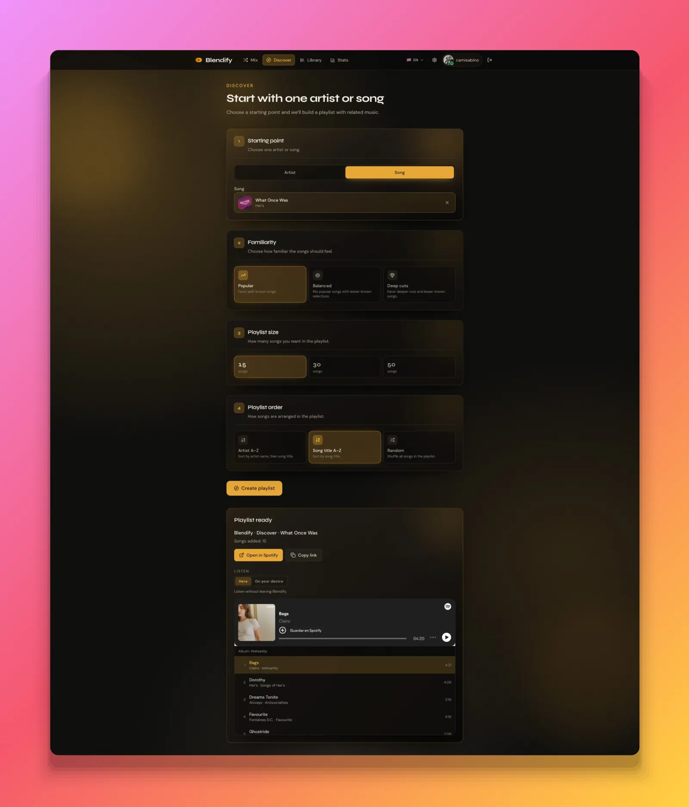
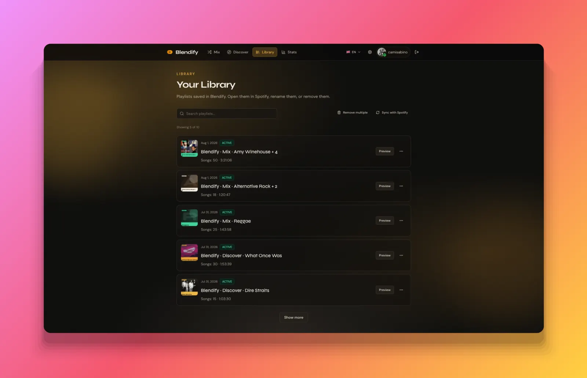
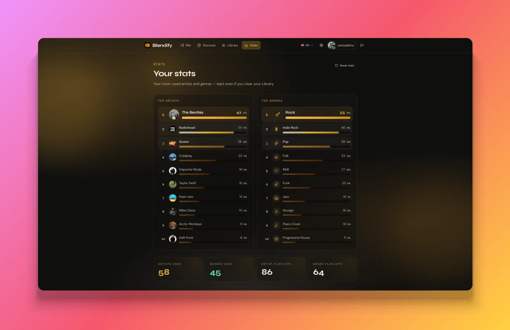

<p align="center">
  
</p>

<h1 align="center">Blendify</h1>

<p align="center">
  Create Spotify mixes from artists or genres, discover related music, and manage every result from one focused workspace.
</p>

<p align="center">
  
  
  
  
  
</p>

<p align="center">
  <a href="https://sonarcloud.io/summary/new_code?id=camilasabino_Blendify">
    
  </a>
  <a href="https://sonarcloud.io/summary/new_code?id=camilasabino_Blendify">
    
  </a>
</p>

<p align="center">
  <a href="docs/media/landing.webp">
    
  </a>
</p>

## Overview

Blendify is a full-stack Spotify playlist builder. It combines Spotify catalog and playback APIs with Last.fm discovery data to create four canonical playlist types:

- **Artist Mix** — combine up to 12 artists.
- **Genre Mix** — build from up to 5 curated genres.
- **Discover Artist** — explore the orbit of one artist.
- **Discover Track** — branch out from one song.

Every generation has a typed, versioned recipe with real seeds, popularity preference, ordering mode, and track budget. Results can be published to Spotify, optionally stored in the Blendify Library, and reviewed later with their original recipe.

## Product highlights

- Spotify OAuth with server-side token storage and HTTP-only sessions.
- Artist and track search with paste-to-resolve support.
- Curated genre catalog and Last.fm-powered recommendations.
- Popular, balanced, and rarities generation modes.
- Artist, title, or random track ordering.
- Optional generated cover artwork.
- In-app preview and Spotify device playback.
- Library summary/detail loading, rename, local removal, and Spotify purge.
- Usage insights that remain independent from Library retention.
- Accessible keyboard navigation for searches, selectors, and dialogs.
- English, neutral Spanish, and Brazilian Portuguese interfaces.

## Architecture

```text
┌──────────────────────┐       REST + HTTP-only cookie       ┌──────────────────────┐
│ React 19 + Vite SPA  │ ──────────────────────────────────▶ │ NestJS 11 API        │
└──────────────────────┘                                      └──────────┬───────────┘
                                                                        │
                         ┌──────────────────────────────────────────────┼──────────────┐
                         ▼                                              ▼              ▼
                  Spotify Web API                                  Last.fm API    PostgreSQL
                         ▲                                              │
                         └──────────── rate limits + Redis cache ────────┘
```

The monorepo uses npm workspaces:

```text
Blendify/
├── apps/
│   ├── api/                  # NestJS application
│   │   ├── prisma/           # schema, migration, and demo seed
│   │   └── src/
│   │       ├── domain/       # entities, rules, value objects, and ports
│   │       ├── application/  # use cases and application services
│   │       ├── infrastructure/
│   │       ├── modules/      # feature composition
│   │       └── presentation/ # controllers, pipes, and exception filter
│   └── web/                  # React SPA
├── packages/
│   └── contracts/            # shared Zod schemas and inferred types
├── docs/                     # brand and product media
└── scripts/                  # local lifecycle helpers
```

The API follows ports-and-adapters boundaries. Spotify is exposed through focused catalog, playlist, and playback clients behind a user-bound provider facade. Shared Zod contracts are the source of truth for HTTP requests, responses, errors, playlist recipes, and statistics.

## Technology

- **Web:** React 19, Vite 8, React Router, TanStack Query, Zustand, Tailwind CSS 4, React Hook Form, Zod, Vitest, Testing Library, oxlint.
- **API:** NestJS 11, Prisma 6, PostgreSQL 16, Redis 7, Passport, Axios, Jest, Supertest, ESLint, Prettier.
- **External services:** Spotify Web API and Last.fm API.
- **Tooling:** TypeScript, npm workspaces, Docker Compose.

## Getting started

### Requirements

- Node.js 20 or newer.
- npm 10 or newer.
- Docker Desktop or compatible PostgreSQL 16 and Redis 7 services.
- A [Spotify Developer](https://developer.spotify.com/dashboard) application.
- A [Last.fm API key](https://www.last.fm/api/account/create).

Spotify playback control requires a Spotify Premium account. Development Mode apps must also allow-list every Spotify account that will sign in.

### 1. Install and configure

```bash
npm install

cp .env.example .env
cp apps/api/.env.example apps/api/.env
cp apps/web/.env.example apps/web/.env
```

Set these values in `apps/api/.env`:

```dotenv
SPOTIFY_CLIENT_ID=
SPOTIFY_CLIENT_SECRET=
LASTFM_API_KEY=
JWT_SECRET=replace-with-a-long-random-value
COOKIE_SECRET=replace-with-a-long-random-value
```

Use this exact Spotify redirect URI:

```text
http://localhost:3000/api/auth/spotify/callback
```

Required Spotify scopes:

```text
user-read-email user-read-private
playlist-modify-public playlist-modify-private
ugc-image-upload
user-read-playback-state user-modify-playback-state
```

Use `localhost` consistently (not `127.0.0.1`). Session cookies are always `Secure`; browsers treat `http://localhost` as a secure context, but plain `http://127.0.0.1` will not store them.

### 2. Start infrastructure and prepare Prisma

```bash
docker compose up -d
npm run db:generate
npm run db:migrate
```

The migration history is intentionally squashed while the project remains unpublished. Reset databases created from an older schema manually; no project command performs a destructive reset implicitly.

### 3. Run the applications

```bash
# Terminal 1 — API
npm run dev:api

# Terminal 2 — Web
npm run dev:web
```

Open http://localhost:5173.

- API: http://localhost:3000
- Swagger: http://localhost:3000/api/docs
- Health: http://localhost:3000/api/health

For a one-command local start, run `npm run start`. Lifecycle logs are written to `.blendify/logs/`.

## Commands

```bash
npm run dev:api          # Nest watch mode
npm run dev:web          # Vite development server
npm run build            # build every workspace
npm run test             # run contract, API, and web tests
npm run lint             # ESLint + oxlint
npm run format:check     # verify API formatting

npm run db:generate      # generate Prisma Client
npm run db:migrate       # create/apply a local Prisma migration
npm run docker:up        # start PostgreSQL and Redis
npm run docker:down      # stop infrastructure

npm run start            # start infrastructure and both applications
npm run stop             # stop Blendify application processes
npm run stop:all         # stop applications and infrastructure
npm run restart
```

## Git hooks and commit messages

This repo uses [Conventional Commits](https://www.conventionalcommits.org/) via Husky + commitlint.

After `npm install`, hooks are installed automatically (`prepare` → husky):

- **pre-commit** — runs `npm run lint` and blocks the commit if lint fails.
- **commit-msg** — requires a Conventional Commit subject (for example `feat: …`, `fix: …`, `docs: …`).
- **pre-push** — runs lint again and validates every commit about to be pushed.

Examples:

```text
feat: add discover-by-track fallbacks
fix: encode Last.fm plus signs for similar artists
docs: add product screenshots to the README
chore: configure SonarCloud in CI
```

To skip hooks locally in an emergency only: `HUSKY=0 git commit …` (not recommended).

## Operational notes

### Spotify quota

Spotify Development Mode has a strict rolling request budget. Blendify limits pressure through Redis-backed search/catalog caches, sequential resolution, lazy suggestions, typed quota errors, and opt-in Library synchronization.

Generation limits:

- 12 artists per Artist Mix.
- 5 genres per Genre Mix.
- 50 tracks per playlist.
- `floor(50 / seedCount)` tracks per seed.

### Cache and resilience

Redis stores external catalog responses and uses append-only persistence in Docker Compose. If Redis is unavailable, the API falls back to an in-memory cache so temporary infrastructure failures do not take down the application.

### API access

Catalog and generation work without a Spotify session. Everything tied to a Spotify account requires one.

| Access | Routes |
| --- | --- |
| Public | `GET /api/health`, `GET /api/auth/spotify`, `GET /api/auth/spotify/callback`, `GET /api/auth/me` (returns `{ "user": null }` without a session), `POST /api/auth/logout` |
| Public, optional session | `GET /api/artists/search`, `GET /api/artists/similar`, `POST /api/artists/resolve`, `GET /api/tracks/search`, `POST /api/generate/mix`, `POST /api/generate/discover` |
| Public, no session lookup | `GET /api/genres`, `GET /api/genres/search`, `GET /api/genres/explore` |
| Spotify session required | `POST /api/playlists/mix`, `POST /api/playlists/discover`, `GET /api/playlists`, `GET/PATCH/DELETE /api/playlists/:id`, `POST /api/playlists/bulk`, `GET/DELETE /api/stats`, `GET /api/player/devices`, `POST /api/player/play` |

- On public routes the session is only used to identify the caller for rate limiting. A missing, expired, invalid, or orphaned session counts as anonymous; it never produces a `401`. An unexpected failure while reading the session also falls back to anonymous and logs a throttled `auth.optional_session_failed` warning.
- `POST /api/generate/mix` and `POST /api/generate/discover` accept the same bodies as their `/api/playlists/*` counterparts without `coverImageBase64` and `persistToLibrary` (unknown fields are rejected). They return the generated playlist (`name`, `description`, `generation`, `seeds`, `tracks`, optional `coverCandidateUrl`) and never publish to Spotify, save to the Library, or record usage statistics. With `Accept: application/x-ndjson` they stream `progress` events (no `publishing` phase) followed by a terminal `result` or `error` event.
- `POST /api/playlists/mix` and `POST /api/playlists/discover` keep their Spotify Mode meaning: generate, publish to Spotify, save to the Library when requested, and record usage statistics.
- Mutating requests must carry an `Origin` (or `Referer`) matching `FRONTEND_URL`, and CORS only admits that origin. This protects signed-in browsers against cross-site requests; it is not an abuse control, since non-browser clients can set any header. Abuse control for public routes comes from the request protection below.

### Request protection

Catalog and generation routes are protected by Redis-backed limits that work across API instances:

- Rate limits per bucket, keyed by user ID when signed in and by client IP otherwise: `search` (artist and track search), `similar` (similar artists), `resolve` (artist name resolution), and `generation` (`/api/playlists/mix|discover` and `/api/generate/mix|discover`). Curated genre routes serve local data with no external provider cost and are intentionally not rate limited. Rejections return `429 RATE_LIMITED` with `Retry-After`. Defaults live in code; `RATE_LIMIT_OVERRIDES` accepts `bucket=limit/windowSeconds` entries (for example `generation=20/600,search=120/60`) and invalid values stop the API at startup.
- Generation concurrency per client and globally (`GENERATION_CONCURRENCY_PER_CLIENT`, `GENERATION_CONCURRENCY_GLOBAL`). Permits are renewable Redis leases, released when the generation finishes or fails; a crashed process frees its permits when the lease expires. Rejections return `429 CONCURRENCY_LIMITED` or `503 CAPACITY_EXCEEDED`.
- Request bodies default to 16 KB; Library bulk actions allow 64 KB, Spotify Mode generation (with cover upload) 512 KB, and public generation (`/api/generate/*`) 32 KB. Oversized bodies return `413 PAYLOAD_TOO_LARGE`.

When Redis is unavailable outside production, limits fall back to process memory. In production they never do: `search` and `similar` stay available (fail-open, with throttled warnings), while `resolve` and generation return `503 SERVICE_UNAVAILABLE` until Redis recovers. The Redis connection reconnects automatically.

Client IP comes from Express `req.ip`. `TRUST_PROXY` defaults to `false`, so forwarded headers are ignored; set a hop count or the proxy addresses/CIDRs for the deployed topology (`true` is rejected). The resolved address must be a valid IP; otherwise the socket address is used. IPv4-mapped IPv6 addresses are normalized; IPv6 clients are keyed by full address, not by /64 prefix.

### Logging

Outbound Spotify, Last.fm, and token-refresh calls use structured JSON logging. Tokens, secrets, API keys, and sensitive query parameters are redacted before output.

## Product tour

### Build a mix

Choose artists or genres, tune familiarity, size, order, and cover artwork, then publish the result directly to Spotify.

<p align="center">
  <a href="docs/media/mix-artists.webp">
    
  </a>
  <a href="docs/media/mix-genres.webp">
    
  </a>
</p>

### Discover related music

Start from an artist or a song and generate a playlist around its musical neighborhood.

<p align="center">
  <a href="docs/media/discover-artist.webp">
    
  </a>
  <a href="docs/media/discover-track.webp">
    
  </a>
</p>

### Keep and understand your playlists

The Library keeps generated playlists available for preview and management, while Stats summarizes the artists and genres used over time.

<p align="center">
  <a href="docs/media/library.webp">
    
  </a>
  <a href="docs/media/stats.webp">
    
  </a>
</p>

Click any screenshot to open it at full size. Media capture and optimization conventions are documented in [`docs/media/README.md`](docs/media/README.md).

## Quality analysis

CI sends TypeScript analysis and test coverage from the API, web app, and shared contracts to [SonarCloud](https://sonarcloud.io/summary/new_code?id=camilasabino_Blendify). The project settings live in [`sonar-project.properties`](sonar-project.properties).

To enable scans, add an Actions repository secret named `SONAR_TOKEN` containing a SonarCloud analysis token. The token used by the public status badge is not the analysis token.

**Required:** disable SonarCloud Automatic Analysis so CI-based scans can run (they cannot run together). In the project: **Administration → Analysis Method → turn off Automatic Analysis**.

## Security

- Spotify access and refresh tokens are stored only in PostgreSQL.
- Browser authentication uses the HTTP-only `blendify_session` cookie.
- HTTP responses use one normalized error envelope.
- External-call logs redact credentials and secrets.
- Environment files stay outside version control; rotate all example secrets before deployment.

## Status

Blendify is pre-release software. Database and HTTP contracts may change before the first public version.

## License

Private and unlicensed.
