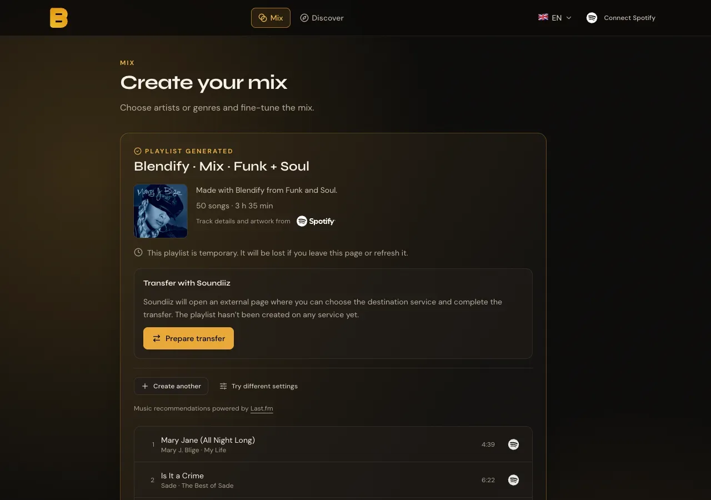
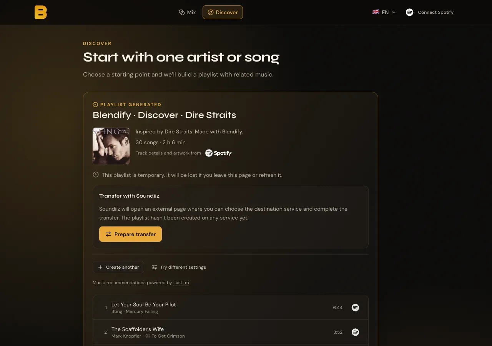
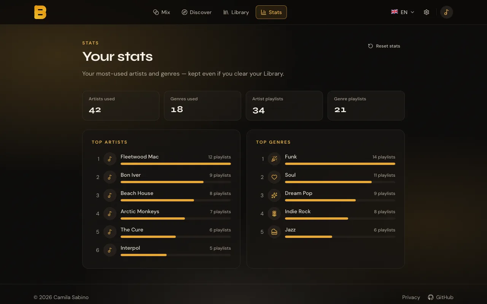
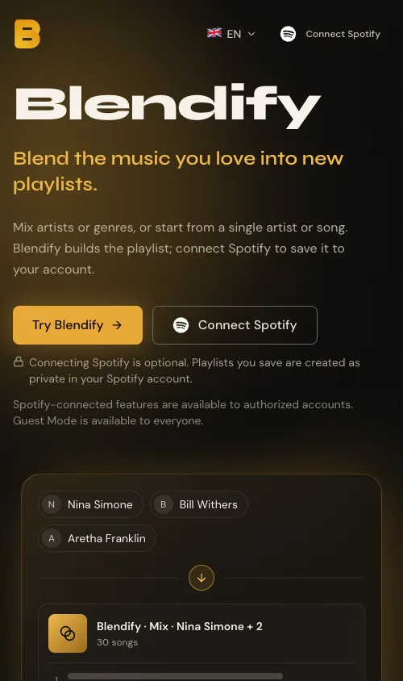

<p align="center">
  
</p>

<h1 align="center">Blendify</h1>

<p align="center">
  Turn a handful of artists, a genre, or a single song into a Spotify playlist — as a guest, or connected to your account.
</p>

<p align="center">
  <a href="https://blendify.camilasabino.dev"><strong>Try it →</strong></a>
</p>

<p align="center">
  <a href="https://github.com/camilasabino/Blendify/actions/workflows/ci.yml">
    
  </a>
  <a href="https://sonarcloud.io/summary/new_code?id=camilasabino_Blendify">
    
  </a>
  <a href="https://sonarcloud.io/summary/new_code?id=camilasabino_Blendify">
    
  </a>
</p>

<p align="center">
  <a href="docs/media/landing.webp">
    
  </a>
</p>

## What it does

Blendify combines the Spotify catalog with Last.fm discovery data to build
four kinds of playlists:

- **Artist Mix** — blend up to 12 artists.
- **Genre Mix** — blend up to 5 curated genres.
- **Discover Artist** — explore one artist's musical neighborhood.
- **Discover Track** — branch out from a single song.

**Guest Mode** needs no account: generate and preview a playlist, then
optionally transfer it to Spotify or another service via
[Soundiiz](https://soundiiz.com). **Connect Spotify** to publish playlists
directly, control playback in-app, and keep a Library and usage Stats across
sessions. Every generation is a typed, versioned recipe (seeds, popularity
preference, order, track budget), so results are reproducible and reviewable.

## Product tour

<p align="center">
  <a href="docs/media/mix-artists.webp"></a>
  <a href="docs/media/mix-genres.webp"></a>
</p>
<p align="center">
  <a href="docs/media/discover-artist.webp"></a>
  <a href="docs/media/discover-track.webp"></a>
</p>
<p align="center">
  <a href="docs/media/guest-transfer.webp"></a>
  <a href="docs/media/library.webp"></a>
</p>
<p align="center">
  <a href="docs/media/stats.webp"></a>
  <a href="docs/media/mobile-landing.webp"></a>
</p>

## Architecture

```text
┌──────────────────────┐       REST + HTTP-only cookie       ┌──────────────────────┐
│ React 19 + Vite SPA  │ ──────────────────────────────────▶ │ NestJS 11 API        │
└──────────────────────┘                                      └──────────┬───────────┘
                                                                        │
                         ┌──────────────────────────────────────────────┼──────────────┐
                         ▼                                              ▼              ▼
                  Spotify Web API                                  Last.fm API    PostgreSQL
                         ▲                                              │
                         └──────────── rate limits + Redis cache ────────┘
```

npm workspaces monorepo:

```text
Blendify/
├── apps/
│   ├── api/                  # NestJS — hexagonal (domain/application/infrastructure/presentation)
│   └── web/                  # React SPA
├── packages/
│   └── contracts/            # Shared Zod schemas + inferred types
├── docs/                     # deployment runbook, brand and product media
└── scripts/                  # local lifecycle helpers
```

The API follows ports-and-adapters: Spotify is exposed through catalog,
playlist, and playback clients behind a user-bound provider facade; domain
logic has no framework or I/O dependencies. `@blendify/contracts` is the
single source of truth for request/response/error shapes shared by both apps.

## Tech stack

| | |
|---|---|
| **Frontend** | React 19, Vite, React Router, TanStack Query, Zustand, Tailwind CSS, React Hook Form, Zod |
| **Backend** | NestJS 11, Prisma, PostgreSQL, Redis, Passport |
| **Integrations** | Spotify Web API, Last.fm API, Soundiiz |
| **Testing/quality** | Jest, Vitest, Testing Library, Playwright, ESLint/oxlint, SonarCloud |
| **Infrastructure** | Cloudflare Workers (web), Railway (API + PostgreSQL + Redis), GitHub Actions |

## Local development

Requirements: Node 22+ (`.nvmrc`), npm 10+, Docker (PostgreSQL 16 + Redis 7),
a [Spotify Developer app](https://developer.spotify.com/dashboard), and a
[Last.fm API key](https://www.last.fm/api/account/create).

```bash
npm install
cp .env.example .env
cp apps/api/.env.example apps/api/.env
cp apps/web/.env.example apps/web/.env
```

Set `SPOTIFY_CLIENT_ID`, `SPOTIFY_CLIENT_SECRET`, `LASTFM_API_KEY`, and
`JWT_SECRET` in `apps/api/.env`. Use
`http://127.0.0.1:3000/api/auth/spotify/callback` as the redirect URI —
Spotify rejects `localhost`, and origins must match exactly. Required
scopes: `user-read-email user-read-private playlist-read-private
playlist-modify-public playlist-modify-private ugc-image-upload
user-read-playback-state user-modify-playback-state`.

```bash
docker compose up -d
npm run db:generate && npm run db:migrate
npm run dev:api    # http://127.0.0.1:3000
npm run dev:web    # http://127.0.0.1:5173
```

Or `npm run start` for a one-command local start (logs in `.blendify/logs/`).

The internal AI service (`apps/ai`, Python via [uv](https://docs.astral.sh/uv/))
is optional; Mix and Discover run without it. To run it locally:

```bash
cp apps/ai/.env.example apps/ai/.env   # then set the same AI_SERVICE_TOKEN
npm run ai:sync                        # and AI_SERVICE_URL in apps/api/.env
npm run dev:ai                         # http://127.0.0.1:8000/health
```

`AI_PROVIDER` is required (`openai`, or `disabled` to keep interpretation
unavailable); `openai` also requires `AI_MODEL` and `OPENAI_API_KEY` (read only
by the AI service). There are no code defaults for provider or model. With
`openai`, each `/app/ai` request is a paid model call. Create with AI
(`/app/ai`) is shown in dev builds; production builds need
`VITE_AI_CREATION_ENABLED=true`.

`npm run start` also starts it when `uv` and `apps/ai/.env` are present.
Playback control requires Spotify Premium; Development Mode apps must
allow-list every account that signs in.

## Commands

```bash
npm run build        # build contracts, API, and web
npm test             # contract, API, and web tests
npm run test:e2e     # Playwright browser suite
npm run lint         # ESLint + oxlint
npm run test:ai      # AI service tests (pytest)
npm run lint:ai      # AI service lint + format check (ruff)
ALLOW_PAID_AI_EVALS=true npm run eval:ai -- --confirm  # paid real-model eval (manual only)
```

Commits follow [Conventional Commits](https://www.conventionalcommits.org/)
(`feat:`, `fix:`, `docs:`, …), enforced by Husky + commitlint; pre-commit and
pre-push also run lint.

## Testing and quality

Jest (API), Vitest (web + contracts), and a small Playwright suite covering
Guest bootstrap, generation, Soundiiz transfer, and Spotify auth failure
paths. CI runs lint, tests, a full build, and a SonarCloud scan on every pull
request and on `main`.

## Deployment

Cloudflare Workers serves the web SPA; the API runs on Railway with private
PostgreSQL and Redis. GitHub Actions runs CI and deploys the web app;
Railway deploys the API on its own GitHub trigger once CI passes. Full
topology, environment variables, IaC, backups, and rollback procedures are
documented in [`docs/deployment.md`](docs/deployment.md).

## External services

Spotify Web API (catalog, playback, publishing), Last.fm API (discovery
data), and [Soundiiz](https://soundiiz.com) (Guest playlist transfer to
Spotify or another service). Blendify credits Spotify and Last.fm wherever
their data is shown, per each provider's terms.

## Security & privacy

- Spotify tokens live only in PostgreSQL; the browser holds only an
  HTTP-only, `Secure` session cookie.
- One normalized error envelope for every API response; outbound logs redact
  credentials and secrets.
- Account deletion is self-service and cascades immediately.
- See the [privacy policy](https://blendify.camilasabino.dev/privacy) and
  [`docs/deployment.md`](docs/deployment.md) for the full security model.

## Status

Live in production and actively maintained. Internal APIs and data contracts
may continue to evolve.

## License

All rights reserved. No open-source license is granted for reuse or
redistribution.
