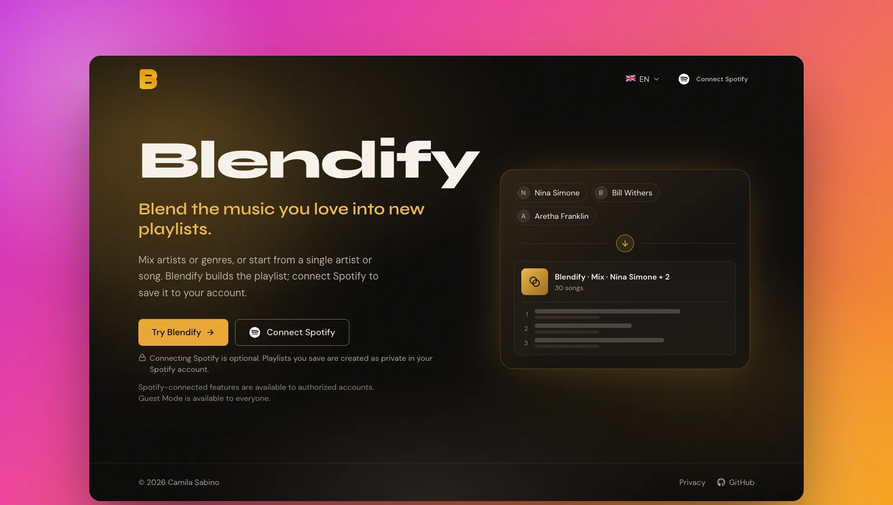
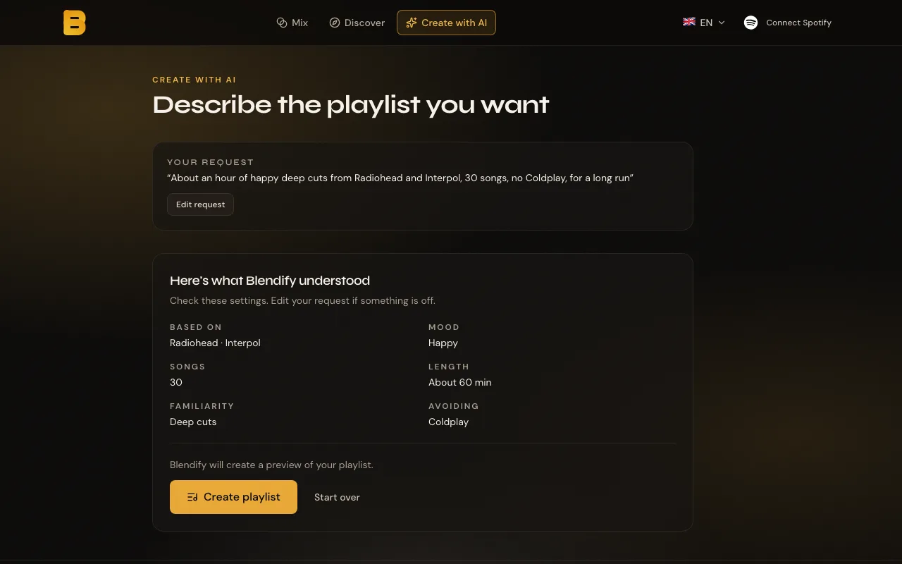
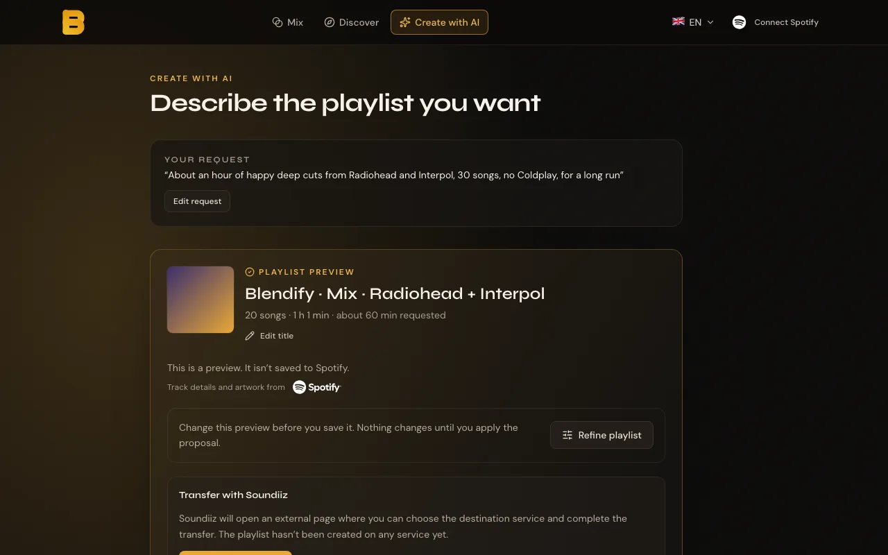
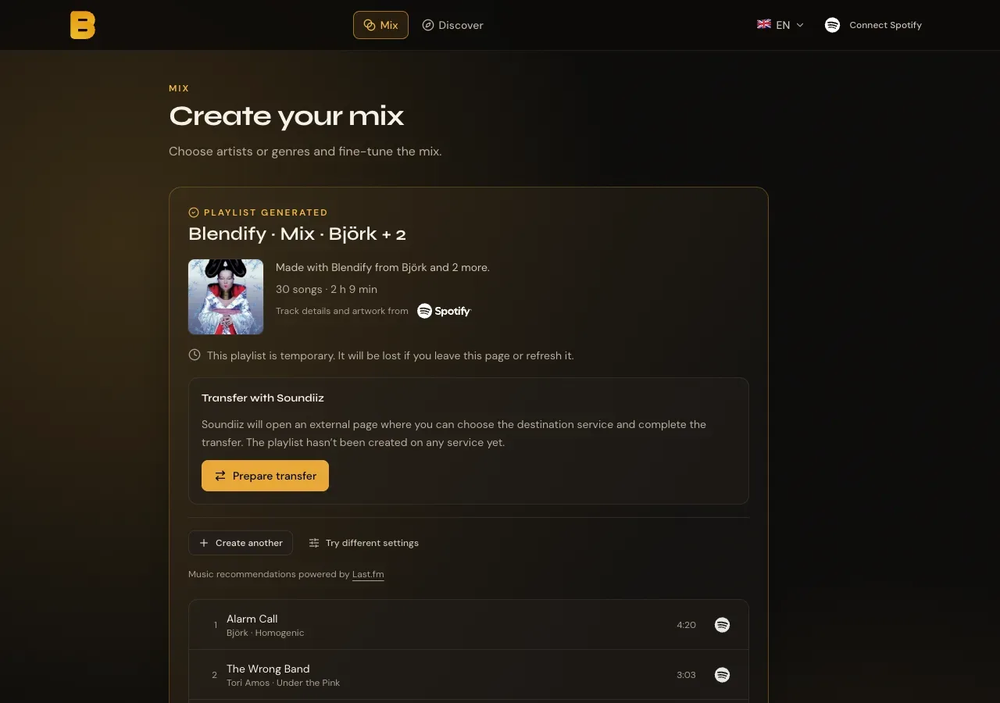
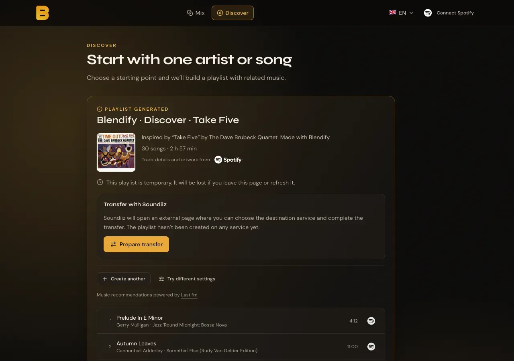
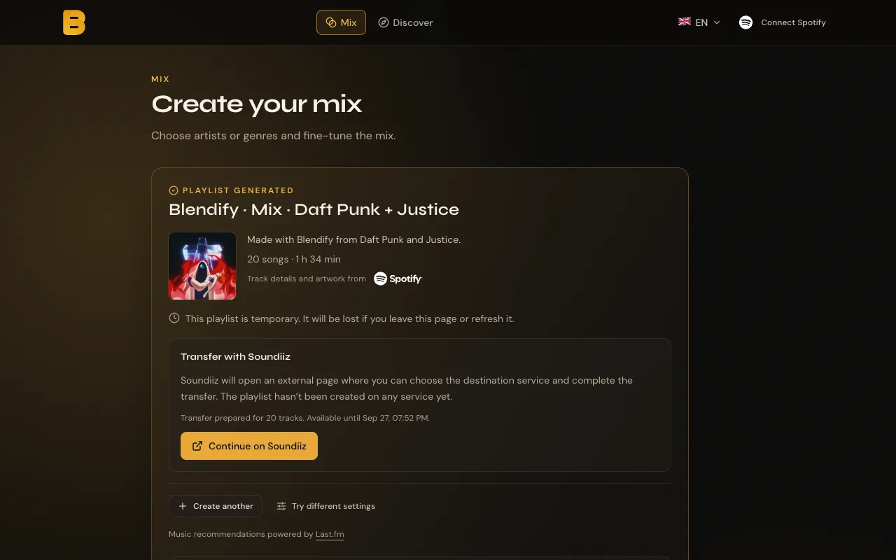
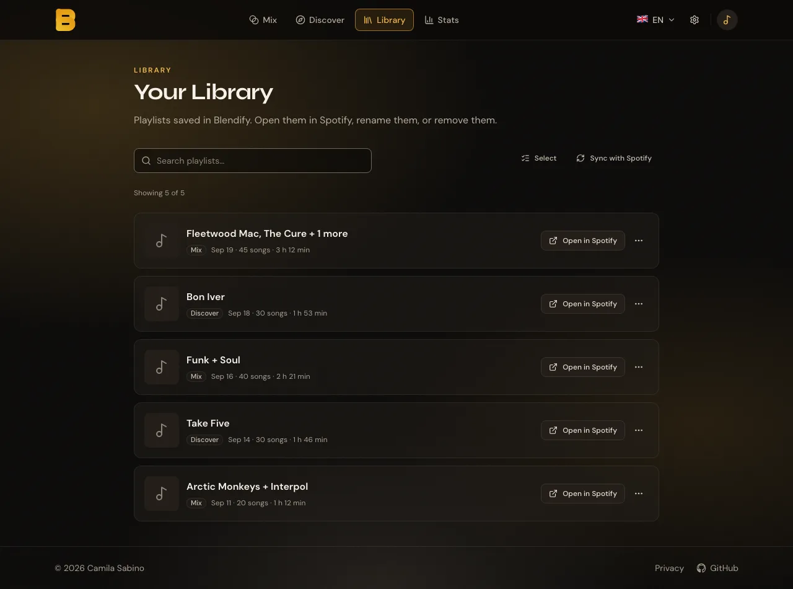
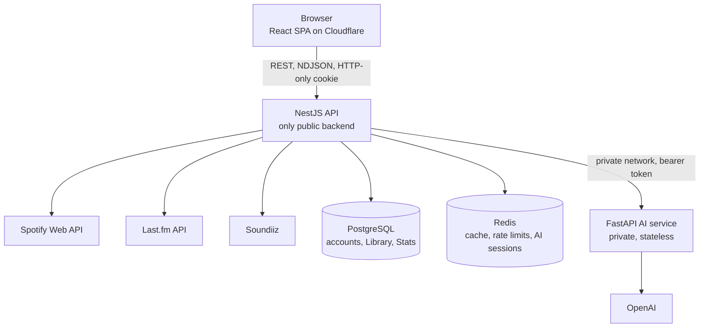

<p align="center">
  
</p>

<h1 align="center">Blendify</h1>

<p align="center">
  Blend the music you love into new playlists — from artists, genres, a single song, or a plain-language description.
</p>

<p align="center">
  <a href="https://blendify.camilasabino.dev"><strong>Try it →</strong></a>
</p>

<p align="center">
  <a href="https://github.com/camilasabino/blendify/actions/workflows/ci.yml">
    
  </a>
  <a href="https://sonarcloud.io/summary/new_code?id=camilasabino_Blendify">
    
  </a>
</p>

<p align="center">
  <a href="docs/media/landing.webp">
    
  </a>
</p>

## What it does

Blendify builds a playlist from music you already know and previews it before
anything is saved. It combines the Spotify catalog with Last.fm discovery data,
in three ways to start:

- **Mix** — blend up to 12 artists, or up to 5 MusicBrainz genres.
- **Discover** — branch out from one artist or one song.
- Results can be refined by decade (the release year the catalog reports for each
  song's version) and by excluding live versions. Genre Mix and Discover results can
  also be refined to one region (a musical scene) or to female vocals, both identified
  through Last.fm artist tags; artists you choose yourself are never filtered by them.
- **Create with AI** — describe the playlist in natural language, review what
  Blendify understood, then create it.

Every generation is a typed, versioned recipe (seeds, result filters,
popularity preference, order, track budget), so a result can be reproduced and reviewed later.

### Guest Mode and Spotify Mode

| | Guest Mode | Spotify Mode |
|---|---|---|
| Account | None | Connect Spotify (limited to authorized accounts while the Spotify app is in Development Mode) |
| Mix, Discover, Create with AI | Yes | Yes |
| Result | Temporary preview | Published to Spotify as a private playlist |
| Destination | Optional transfer to Spotify or another service through [Soundiiz](https://soundiiz.com) | Direct publish, with an optional Blendify cover |
| Library, Stats, in-app playback | No | Yes (playback needs Spotify Premium) |

## Create with AI

The model only interprets what you write. A private FastAPI service turns a
prompt (and, after a preview exists, refinement requests) into a typed intent
that you confirm. Blendify's deterministic application logic then
resolves artists and tracks against Spotify and Last.fm, exactly as Mix and
Discover do. Spotify, Last.fm, and Soundiiz data never reaches the model, and
the model does not choose tracks. Details:
[`docs/engineering/ai-data-handling.md`](docs/engineering/ai-data-handling.md).

<p align="center">
  <a href="docs/media/create-with-ai-review.webp"></a>
  <a href="docs/media/create-with-ai-result.webp"></a>
</p>

## Product tour

<p align="center">
  <a href="docs/media/mix-artists.webp"></a>
  <a href="docs/media/discover-track.webp"></a>
</p>
<p align="center">
  <a href="docs/media/guest-transfer.webp"></a>
  <a href="docs/media/library.webp"></a>
</p>

More captures live in [`docs/media/`](docs/media/README.md).

## Architecture


```mermaid
flowchart TD
    Browser["Browser<br/>React SPA on Cloudflare"] -->|"REST, NDJSON, HTTP-only cookie"| API["NestJS API<br/>only public backend"]
    API --> Spotify["Spotify Web API"]
    API --> LastFm["Last.fm API"]
    API --> Soundiiz["Soundiiz"]
    API --> PG[("PostgreSQL<br/>accounts, Library, Stats")]
    API --> Redis[("Redis<br/>cache, rate limits, AI sessions")]
    API -->|"private network, bearer token"| AI["FastAPI AI service<br/>private, stateless"]
    AI --> OpenAI["OpenAI"]
```

- The browser talks only to the NestJS API. The AI service has no public
  domain, and its bearer token and the OpenAI key never reach the browser.
- The AI service receives only user-authored text and AI-safe structured
  state. It never receives provider data, IDs, URLs, or tokens, and it never
  calls Spotify, Last.fm, or Soundiiz.
- Mix, Discover, publishing, and transfer do not depend on the AI service, so
  they keep working when it is unavailable or disabled.
- The API follows ports-and-adapters: `domain/` has no framework or I/O
  dependencies, `application/` holds use cases, `infrastructure/` holds the
  Spotify, Last.fm, Soundiiz, AI-service, Redis, and Prisma adapters.
- `@blendify/contracts` (Zod) is the source of truth for request, response,
  and error shapes shared by the API and the web app, and for the wire
  contract of the AI service, which the Python side mirrors.

## Repository structure

npm workspaces monorepo, plus a Python service managed by `uv`:

```text
blendify/
├── apps/
│   ├── api/          # NestJS API, Prisma schema and migrations
│   ├── web/          # React SPA (Vite), Playwright e2e
│   └── ai/           # private FastAPI AI service (Python, uv; not an npm workspace)
├── packages/
│   └── contracts/    # shared Zod schemas, inferred types, AI-service contract
├── docs/             # deployment runbook, engineering notes, brand and media
└── scripts/          # local lifecycle helpers (start, stop, restart, reset)
```

Each app has its own README: [`apps/api`](apps/api/README.md),
[`apps/web`](apps/web/README.md), [`apps/ai`](apps/ai/README.md), and
[`packages/contracts`](packages/contracts/README.md).

## Tech stack

| | |
|---|---|
| **Web** | React 19, Vite, TypeScript, React Router, TanStack Query, Zustand, Tailwind CSS, React Hook Form, Zod |
| **API** | NestJS 11, Express 5, Prisma, PostgreSQL, Redis (ioredis), Passport, Zod |
| **AI service** | Python 3.13, FastAPI, Pydantic, OpenAI SDK, uv, ruff, pytest |
| **Integrations** | Spotify Web API, Last.fm API, Soundiiz, OpenAI (through the AI service only) |
| **Testing** | Jest, Vitest, Testing Library, Playwright, pytest, SonarCloud coverage |
| **Infrastructure** | Cloudflare Workers (web), Railway (API, AI service, PostgreSQL, Redis), GitHub Actions |

## Local development

Requirements: Node 22+ (`.nvmrc`), npm 10+, Docker (PostgreSQL 16 + Redis 7),
a [Spotify Developer app](https://developer.spotify.com/dashboard), and a
[Last.fm API key](https://www.last.fm/api/account/create). The AI service
additionally needs [uv](https://docs.astral.sh/uv/).

```bash
npm install
cp apps/api/.env.example apps/api/.env
cp apps/web/.env.example apps/web/.env
```

The API reads `apps/api/.env` and falls back to a root `.env` (see the root
`.env.example`, which mirrors the API file).

Set `SPOTIFY_CLIENT_ID`, `SPOTIFY_CLIENT_SECRET`, `LASTFM_API_KEY`, and
`JWT_SECRET` in `apps/api/.env`. Use
`http://127.0.0.1:3000/api/auth/spotify/callback` as the redirect URI —
Spotify rejects `localhost`, and origins must match exactly. The scopes are in
`SPOTIFY_SCOPES` in `apps/api/.env.example`.

```bash
docker compose up -d
npm run db:generate && npm run db:migrate
npm run dev:api    # http://127.0.0.1:3000
npm run dev:web    # http://127.0.0.1:5173
```

Or `npm run start` for a one-command local start (logs in `.blendify/logs/`).

### AI service (optional)

Mix and Discover run without it. Development builds show Create with AI at
`/app/ai`; without a reachable service it reports AI as unavailable.

```bash
cp apps/ai/.env.example apps/ai/.env   # then use the same AI_SERVICE_TOKEN as apps/api/.env
npm run ai:sync
npm run dev:ai                         # http://127.0.0.1:8000/health
```

Set `AI_SERVICE_URL` and `AI_SERVICE_TOKEN` in `apps/api/.env` so the API can
reach it. `AI_PROVIDER` has no default: use `disabled` to keep interpretation
unavailable, or `openai` with `AI_MODEL` and `OPENAI_API_KEY` (read only by the
AI service). With `openai`, every interpretation or refinement request is a
paid model call. `npm run start` also starts the service when `uv` and
`apps/ai/.env` are present.

Automated tests, lint, and CI use fakes and never call a real model.
Real-model evals are manual and gated behind explicit opt-in (see
[`apps/ai/README.md`](apps/ai/README.md)). Never put production secrets in a
local `.env`.

Production builds show Create with AI only when `VITE_AI_CREATION_ENABLED=true`
is set at build time.

## Commands

```bash
npm run build        # build contracts, API, and web
npm test             # contract, API, and web tests
npm run test:e2e     # Playwright browser suite (mocked API)
npm run lint         # ESLint + oxlint
npm run format:check # Prettier (API)
npm run test:ai      # AI service tests (pytest)
npm run lint:ai      # AI service lint + format check (ruff)
```

Commits follow [Conventional Commits](https://www.conventionalcommits.org/)
(`feat:`, `fix:`, `docs:`, …), enforced by Husky + commitlint; pre-commit and
pre-push also run lint.

## Testing and quality

Jest (API), Vitest (web and contracts), pytest (AI service), and a Playwright
suite that mocks Blendify's own API at the browser boundary, so no test calls
Spotify, Last.fm, Soundiiz, or OpenAI. CI runs formatting, lint, each test
suite, the AI-service checks, a full build, and the e2e suite on every pull
request and on `main`; a separate workflow sends coverage to SonarCloud.

## Deployment

Cloudflare Workers serves the web SPA. The API and the private AI service run
on Railway with PostgreSQL and Redis on its private network. GitHub Actions
runs CI and deploys the web app once CI passes on `main`; Railway deploys the
API and AI service from their own GitHub triggers. Topology, environment
variables, IaC, backups, and rollback are documented in
[`docs/deployment.md`](docs/deployment.md).

## Security and privacy

- Spotify tokens live only in PostgreSQL; the browser holds only an
  HTTP-only, `Secure` session cookie.
- Create with AI sessions live in Redis for 30 minutes. A Guest session is
  opened only with a random access key sent in a request header, never in a
  URL.
- Logs record metadata (operation, result, duration, counts), not prompts,
  track names, or provider content. Outbound logs redact credentials.
- One normalized error envelope for every API response.
- Account deletion is self-service and removes the account, Library, and Stats
  from PostgreSQL immediately.
- See the [privacy policy](https://blendify.camilasabino.dev/privacy) and
  [`docs/engineering/ai-data-handling.md`](docs/engineering/ai-data-handling.md).

## Documentation

| Document | Audience |
|---|---|
| [`apps/api/README.md`](apps/api/README.md), [`apps/web/README.md`](apps/web/README.md), [`apps/ai/README.md`](apps/ai/README.md), [`packages/contracts/README.md`](packages/contracts/README.md) | Working inside one workspace |
| [`docs/engineering/code-conventions.md`](docs/engineering/code-conventions.md) | Architecture and review conventions |
| [`docs/engineering/ai-data-handling.md`](docs/engineering/ai-data-handling.md) | Where AI data goes and what is logged |
| [`docs/deployment.md`](docs/deployment.md) | Production runbook |
| [`docs/media/README.md`](docs/media/README.md) | Screenshot and media maintenance |
| [`CLAUDE.md`](CLAUDE.md) | Working rules for coding agents |

## External services

Spotify Web API (catalog, playback, publishing), Last.fm API (discovery data),
[Soundiiz](https://soundiiz.com) (Guest playlist transfer), and OpenAI
(request interpretation, behind the private AI service). Blendify credits
Spotify and Last.fm wherever their data is shown, per each provider's terms.

## Language deep links

Blendify opens in an explicit language with `?lang=es`, `?lang=en`, or
`?lang=pt` (for example `https://blendify.camilasabino.dev/?lang=en`).
Precedence: valid `?lang=` > stored preference > browser language > English.
A valid `?lang=` is saved as the new preference; invalid values are ignored.

## Status

Live in production and actively maintained. Internal APIs and data contracts
may continue to evolve.

## License

All rights reserved. No open-source license is granted for reuse or
redistribution.
